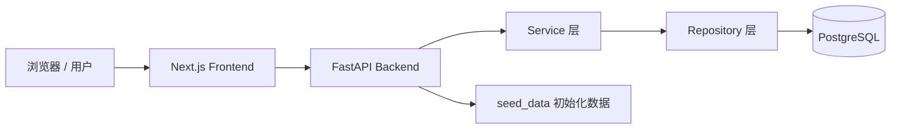

# 项目总体架构

Bioinformatics Web 采用前后端分离架构。前端负责页面渲染、交互和用户体验，后端负责 API、业务逻辑、数据库访问和数据初始化。



## 目录职责

```text
backend/
  app/
    api/v1/controllers/   FastAPI 路由层
    services/             业务逻辑层
    repositories/         数据库访问层
    models/               SQLAlchemy ORM 模型
    schemas/              Pydantic 请求/响应模型
    core/                 配置、数据库、异常处理
    seed_data/            Pipeline/Algorithm/Literature 初始化数据
  init_db.py              建表、补字段、调用 seed 函数

frontend/
  app/                    Next.js App Router 页面
  components/             可复用 UI 组件
```

## 请求链路

以 Pipeline 详情页为例：

1. 用户打开 `/pipelines/9`。
2. `frontend/app/pipelines/[id]/page.tsx` 请求后端 `/api/pipelines/9`。
3. 后端 `pipeline_controller.py` 接收请求。
4. Controller 调用 `PipelineService`。
5. Service 调用 `PipelineRepository`。
6. Repository 通过 SQLAlchemy 查询 PostgreSQL。
7. 后端返回 Pydantic 结构化数据。
8. 前端渲染标题、元数据、Markdown、DAG、同类推荐和关联资源。

## 分层原则

- Controller 只负责 HTTP 入参、响应模型和路由组织。
- Service 负责业务判断，例如数据不存在时返回 404。
- Repository 只负责数据库查询。
- Model 只描述数据库表结构。
- Schema 只描述 API 数据结构。
- seed_data 只负责初始化 mock 数据，不参与运行时业务逻辑。

