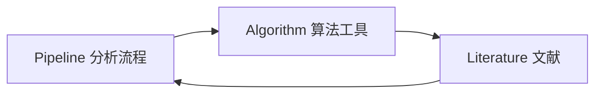

# 业务模块说明

当前平台有三个核心业务模块：Pipeline、Algorithm、Literature。

## Pipeline Hub

Pipeline 是平台的核心内容单元，表示一个完整生信分析流程。

包含内容：

- 流程标题和简介
- 组学类型
- 分类字段
- DAG 流程节点
- 结构化元数据
- Markdown 分析文档

典型页面：

- `/pipelines`
- `/pipelines/[id]`

关键能力：

- 搜索和筛选
- 分类分组
- Markdown 渲染
- 右侧目录 TOC
- 同类推荐
- 关联算法和文献

## Algorithm Gallery

Algorithm 表示算法或工具，例如 BWA-MEM、Seurat、Cell Ranger。

包含内容：

- 算法名称
- 分类
- 一句话简介
- 性能基准 JSON
- Markdown 原理文档

典型页面：

- `/algorithms`
- `/algorithms/[id]`

关键能力：

- 工具卡片展示
- 性能图表
- Markdown 文档
- 关联流程和文献

## Literature Hub

Literature 表示文献动态和经典论文。

包含内容：

- 标题
- 作者
- 期刊
- 年份
- DOI
- 摘要
- 可选关联 Pipeline
- 可选关联 Algorithm

典型页面：

- `/literatures`
- `/literatures/[id]`

## 三者关系

关系来源：

- Literature 表中的 `pipeline_id`
- Literature 表中的 `algorithm_id`
- Pipeline 元数据中的工具名称
- Pipeline 分类字段 `category_key`

