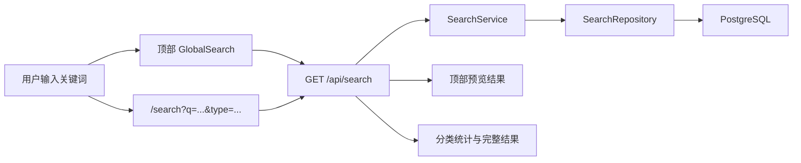

# 统一搜索中心设计

## 1. 背景

平台当前已经具备分析流程、软件与算法、数据库导航、数据库教程和文献详情页。顶部导航栏也已经加入搜索入口，但搜索逻辑仍由前端临时聚合：

- Pipeline 通过 `/api/pipelines?keyword=...` 搜索。
- Software & Algorithm 通过 `/api/algorithms?keyword=...` 搜索。
- Literature 先获取完整列表，再由前端过滤。
- Database 和 Database Tutorial 仍保存在前端静态文件中。

这种方式适合验证交互，但不适合内容持续增长后的检索、排序和维护。因此，下一阶段要把搜索升级为后端统一能力。

## 2. 目标

新增后端统一搜索接口和独立搜索结果页，让用户可以：

1. 在任意页面顶部输入关键词并查看即时预览。
2. 按回车或点击“查看全部结果”进入 `/search?q=关键词`。
3. 在完整搜索页按资源类型筛选结果。
4. 按相关度查看 Pipeline、Software & Algorithm、Database、Tutorial、Literature。

第一版不引入 Elasticsearch，也不做 PostgreSQL 中文全文分词。采用字段权重和 `ILIKE`，保持部署简单、行为可解释。

## 3. 范围

### 3.1 本阶段包含

- 将数据库资源和教程从前端静态文件迁移到 PostgreSQL。
- 新增数据库资源和教程的后端分层模块。
- 新增后端统一搜索模块。
- 新增 `/api/search` 统一接口。
- 新增 `/search` 前端完整搜索结果页。
- 改造顶部即时搜索组件，统一请求 `/api/search`。
- 保持现有 Pipeline、Software & Algorithm、Database Tutorial、Literature 详情页链接可用。

### 3.2 本阶段不包含

- 用户登录、收藏、搜索历史。
- 管理后台。
- Elasticsearch。
- PostgreSQL `tsvector`、中文分词插件。
- 搜索结果分页。第一版通过 `limit` 控制返回数量。
- 热门搜索和搜索日志统计。

## 4. 后端设计

### 4.1 模块结构

后端继续遵循 Controller-Service-Repository 分层：

```text
backend/app/
├── models/
│   ├── database_resource.py
│   └── database_tutorial.py
├── schemas/
│   ├── database_resource.py
│   └── search.py
├── repositories/
│   ├── database_repository.py
│   └── search_repository.py
├── services/
│   ├── database_service.py
│   └── search_service.py
└── api/v1/controllers/
    ├── database_controller.py
    └── search_controller.py
```

### 4.2 数据库资源模型

`DatabaseResource` 保存数据库导航页所需信息：

| 字段 | 类型 | 说明 |
|---|---|---|
| `id` | `int` | 主键 |
| `slug` | `str` | 稳定 URL 标识，例如 `ncbi` |
| `name` | `str` | 简称，例如 `NCBI` |
| `full_name` | `str` | 全称 |
| `category_key` | `str` | 分类键 |
| `category_name` | `str` | 分类显示名称 |
| `description` | `Text` | 简介 |
| `use_cases_json` | `JSON` | 应用场景 |
| `data_types_json` | `JSON` | 数据类型 |
| `species_json` | `JSON` | 物种 |
| `tags_json` | `JSON` | 标签 |
| `url` | `str` | 官方主页 |
| `download_url` | `str \| None` | 下载入口 |
| `api_url` | `str \| None` | API 入口 |
| `region` | `str` | 地区 |
| `rating` | `int` | 推荐等级 |
| `created_at` | `datetime` | 创建时间 |

### 4.3 数据库教程模型

`DatabaseTutorial` 保存数据库教程：

| 字段 | 类型 | 说明 |
|---|---|---|
| `id` | `int` | 主键 |
| `slug` | `str` | 稳定 URL 标识 |
| `database_resource_id` | `int` | 外键，关联数据库资源 |
| `title` | `str` | 教程标题 |
| `scenario` | `Text` | 使用场景 |
| `steps_json` | `JSON` | 步骤速览 |
| `example_query` | `Text \| None` | 示例查询 |
| `entry_url` | `str` | 官方入口 |
| `content` | `Text` | Markdown 教程正文 |
| `created_at` | `datetime` | 创建时间 |

删除数据库资源时，关联教程采用级联删除。

### 4.4 数据库资源接口

```text
GET /api/databases
GET /api/databases/{slug}
GET /api/databases/tutorials/{slug}
```

`GET /api/databases` 支持：

```text
keyword
category_key
data_type
species
limit
```

### 4.5 统一搜索接口

```text
GET /api/search?q=RNA-seq&type=all&limit=20
```

查询参数：

| 参数 | 说明 |
|---|---|
| `q` | 必填，去除首尾空格后至少 2 个字符 |
| `type` | 可选：`all`、`pipeline`、`algorithm`、`database`、`tutorial`、`literature` |
| `limit` | 可选，默认 `20`，最大 `50` |

返回结构：

```json
{
  "query": "RNA-seq",
  "total": 12,
  "counts": {
    "pipeline": 5,
    "algorithm": 3,
    "database": 2,
    "tutorial": 1,
    "literature": 1
  },
  "items": [
    {
      "id": "pipeline-1",
      "type": "pipeline",
      "title": "Bulk RNA-seq 标准差异表达分析增强版",
      "description": "从原始 FASTQ 到差异基因和下游解释。",
      "href": "/pipelines/1",
      "tags": ["RNA-Seq", "expression"],
      "score": 100
    }
  ]
}
```

### 4.6 相关度规则

第一版采用字段权重和 `ILIKE`：

| 命中位置 | 分值 |
|---|---:|
| 标题或名称完全匹配 | 100 |
| 标题或名称包含关键词 | 70 |
| 分类、标签、组学类型命中 | 40 |
| 简介、摘要命中 | 20 |
| Markdown 正文命中 | 10 |

同一资源只保留最高命中分值。相同分值时，按资源类型稳定排序：

```text
Pipeline → Software & Algorithm → Database → Tutorial → Literature
```

同类型、同分值时按主键升序，确保返回顺序稳定。

### 4.7 错误处理

沿用现有全局异常格式：

```json
{
  "code": 400,
  "message": "搜索关键词至少需要 2 个字符",
  "data": null
}
```

## 5. Seed 数据迁移

把前端 `frontend/lib/databaseResources.ts` 中的数据库资源和教程迁移到：

```text
backend/app/seed_data/
├── databases.py
└── database_tutorials.py
```

在 `backend/init_db.py` 中追加 seed 调用。Seed 操作必须可重复执行，以 `slug` 判断数据是否已存在。

迁移完成后：

- 数据库导航页从 `/api/databases` 获取数据。
- 教程详情页从 `/api/databases/tutorials/{slug}` 获取数据。
- 前端删除数据库正文副本，仅保留 TypeScript 类型定义和 API 调用函数。

## 6. 前端设计

### 6.1 文件结构

```text
frontend/
├── app/
│   └── search/
│       └── page.tsx
├── components/
│   ├── GlobalSearch.tsx
│   └── SearchResults.tsx
└── lib/
    ├── databaseApi.ts
    ├── searchApi.ts
    └── searchTypes.ts
```

### 6.2 顶部即时预览

改造现有 `GlobalSearch.tsx`：

- 输入至少 2 个字符后请求 `/api/search?q=...&limit=8`。
- 250ms 防抖。
- 下拉框展示高相关度结果。
- 每个结果展示类型、标题和简短描述。
- 点击结果进入详情页。
- 按 `Enter` 进入 `/search?q=关键词`。
- 下拉框底部增加“查看全部结果”。
- 请求失败时显示简短错误状态，不影响导航栏正常使用。

### 6.3 完整搜索结果页

新增 `/search?q=RNA-seq&type=all`：

- 页面标题展示搜索关键词和结果总数。
- 搜索框允许继续修改关键词。
- 分类标签展示：

```text
全部 / 分析流程 / 软件与算法 / 数据库 / 教程 / 文献
```

- 每个标签展示数量。
- 切换分类时同步 URL 中的 `type`。
- 结果按相关度固定排序。
- 空结果时展示推荐关键词：

```text
RNA-seq / Seurat / GEO / WGCNA / CUT&Tag
```

第一版不提供排序下拉框，不提供高级筛选面板。

## 7. 数据流



## 8. 测试与验证

### 8.1 后端

- `q` 少于 2 个字符时返回标准化错误。
- 标题完全匹配排在标题包含之前。
- 类型筛选只返回指定资源类型。
- 相同分值时排序稳定。
- 数据库资源和教程接口可以正确返回迁移后的数据。
- Seed 脚本重复执行不会插入重复记录。

### 8.2 前端

- 顶部搜索框输入两个字符后请求统一接口。
- 按回车进入 `/search?q=...`。
- “查看全部结果”跳转正确。
- 搜索结果页切换分类后 URL 同步。
- 搜索为空、无结果、接口失败时显示对应状态。

### 8.3 回归验证

- `/pipelines`
- `/algorithms`
- `/databases`
- `/literatures`
- `/pipelines/{id}`
- `/algorithms/{id}`
- `/databases/tutorials/{slug}`
- `/literatures/{id}`

以上页面均应返回 `200`，详情页关联链接保持可用。

## 9. 后续演进

本阶段完成后，再按实际数据规模决定是否升级：

1. PostgreSQL 全文索引和中文分词。
2. 搜索日志与热门关键词。
3. 搜索历史和用户收藏。
4. 管理后台中的内容编辑和发布。

