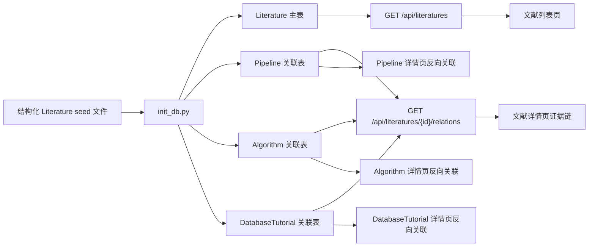

# 文献与动态集：轻量证据中心设计

## 1. 背景

平台已经具备分析流程、软件与算法、数据库导航、数据库教程和全站搜索能力。现有 Literature 模块可以展示论文列表、详情、DOI 外链，并通过单一 `pipeline_id` 和 `algorithm_id` 关联少量平台资源。

当前实现适合作为演示，但不足以支撑公开知识平台：

- 文献数量少，只有基础英文摘要，学习价值有限。
- 文献没有稳定分类，无法区分经典方法、综述指南和前沿研究。
- 一篇论文最多关联一个流程和一个软件，不能表达真实证据链。
- 列表没有独立搜索和筛选能力。
- 详情页没有中文导读、推荐理由、核心结论和复核状态。

本轮将 Literature 模块升级为一个轻量证据中心：围绕现有平台内容人工精选高质量文献，让用户能够检索、判断、学习并跳转到相关流程、软件和数据库教程。

## 2. 产品定位

文献与动态集服务两类内容：

1. **长期沉淀的经典文献**：支撑流程方法、软件原理和最佳实践。
2. **人工精选的前沿动态**：记录值得关注的新方法、新版本和新研究方向。

MVP 不做自动抓取、定时任务、登录权限或后台录入页面。内容通过独立结构化 seed 数据文件人工维护，优先保证准确性、可读性和关联质量。

## 3. 范围

### 3.1 本轮包含

- 扩展 Literature 结构化元数据。
- 新增 Literature 与 Pipeline、Algorithm、DatabaseTutorial 的多对多关联。
- 扩展文献列表接口，支持搜索、筛选和排序。
- 升级列表页，筛选状态同步到 URL。
- 升级详情页，展示中文导读、核心结论、适用场景和完整证据链。
- 扩充首批人工精选文献，优先覆盖已有流程与软件。
- 保持现有 Pipeline 与 Algorithm 详情页的反向关联能力。
- 为数据库教程详情页补充关联文献入口。

### 3.2 本轮不包含

- PubMed、Europe PMC 或 Crossref 自动同步。
- DOI 或 PMID 批量导入页面。
- 管理后台、登录权限、审核流。
- 收藏、评论、阅读进度或个性化推荐。
- 全文下载、全文镜像或受版权保护的论文内容。

## 4. 内容策略

首批人工精选约 `20-30` 篇，紧贴平台已存在的 Pipeline 与 Algorithm：

- bulk RNA-seq、单细胞 RNA-seq、空间转录组。
- WGS、BSA-seq、CUT&Tag。
- STAR、Salmon、featureCounts、DESeq2、Seurat、Cell Ranger。
- WGCNA、rMATS、STAR-Fusion、Trinity 等已有流程涉及的核心工具。

每篇文献必须至少满足一个条件：

- 是平台中某个流程或软件的经典方法论文。
- 是某个分析方向的高质量综述或实践指南。
- 是经过人工判断值得展示的前沿研究动态。

前沿动态仍然采用人工精选，不追求高频更新。每条记录展示最近复核日期，避免把旧内容误当成最新结论。

## 5. 数据模型

### 5.1 Literature 扩展字段

保留现有字段：

- `id`
- `title`
- `authors`
- `journal`
- `publication_year`
- `doi`，迁移后允许为空；缺少 DOI 时必须提供 PMID
- `abstract_text`

新增字段：

| 字段 | 类型 | 说明 |
| --- | --- | --- |
| `pmid` | `String \| None` | PubMed ID，可为空，建立索引；与 DOI 至少提供一个 |
| `literature_type` | `String` | `classic_method`、`review_guide`、`frontier_research` |
| `topic_key` | `String` | 稳定主题键，例如 `bulk-rnaseq`、`single-cell`、`variant` |
| `topic_name` | `String` | 用户可读主题名 |
| `keywords_json` | `JSON` | 关键词数组 |
| `chinese_summary` | `Text` | 中文导读 |
| `recommendation_reason` | `Text` | 推荐阅读理由 |
| `key_findings_json` | `JSON` | 核心结论数组 |
| `applicable_scenarios_json` | `JSON` | 适用场景数组 |
| `published_at` | `Date \| None` | 精确发表日期，可为空 |
| `last_reviewed_at` | `Date` | 平台最近人工复核日期 |
| `source_url` | `String \| None` | 官方入口或期刊入口，可为空 |
| `is_featured` | `Boolean` | 是否为人工推荐内容，默认 `False` |
| `created_at` | `DateTime` | 入库时间 |

### 5.2 旧外键迁移

现有 `pipeline_id` 与 `algorithm_id` 不再作为核心关系来源。迁移脚本需要将旧关联写入多对多表，保证已有 seed 和页面跳转不丢失。

完成迁移后，旧字段不再由 API 暴露。为降低本轮风险，数据库字段可以暂时保留，但业务代码不得继续依赖它们。后续正式引入 Alembic 后再删除旧列。

### 5.3 多对多关联表

新增：

| 表名 | 字段 | 作用 |
| --- | --- | --- |
| `literature_pipeline_links` | `literature_id`, `pipeline_id` | 一篇论文关联多个流程 |
| `literature_algorithm_links` | `literature_id`, `algorithm_id` | 一篇论文关联多个软件与算法 |
| `literature_database_tutorial_links` | `literature_id`, `database_tutorial_id` | 一篇论文关联多个数据库教程 |

每张关系表使用联合主键或唯一约束，避免重复关联。

## 6. 后端设计

后端继续遵循 Controller-Service-Repository 分层结构。

### 6.1 列表接口

`GET /api/literatures`

支持参数：

| 参数 | 说明 |
| --- | --- |
| `keyword` | 搜索标题、作者、DOI、PMID、期刊、中文导读、关键词 |
| `literature_type` | 按文献类型筛选 |
| `topic_key` | 按主题筛选 |
| `publication_year` | 按年份筛选 |
| `linked_only` | 仅显示已关联平台资源的文献 |
| `limit` | 默认 `100`，最大 `200` |

默认排序：

1. 人工推荐优先。
2. `publication_year` 倒序。
3. `id` 倒序。

为了支持推荐排序，Literature 新增 `is_featured: bool` 字段，默认 `False`。

### 6.2 详情接口

`GET /api/literatures/{id}`

返回完整结构化导读信息，但不在主响应内展开全部关联对象。

### 6.3 关系接口

`GET /api/literatures/{id}/relations`

返回：

- `pipelines: list[RelatedPipeline]`
- `algorithms: list[RelatedAlgorithm]`
- `database_tutorials: list[RelatedDatabaseTutorial]`

现有接口继续保留：

- `GET /api/pipelines/{id}/relations`
- `GET /api/algorithms/{id}/relations`

数据库教程详情页增加对应的反向关系读取能力。

新增：

- `GET /api/databases/tutorials/{tutorial_slug}/relations`

### 6.4 错误处理

- 文献不存在时返回标准化 `404`。
- 非法年份、超出范围的 `limit` 由 FastAPI/Pydantic 返回标准化校验错误。
- 未命中筛选时返回空数组，不返回异常。
- 关系表中的目标记录不存在时，seed 初始化脚本跳过该关系并输出可读警告。

## 7. Seed 数据维护

文献内容从 Python 逻辑中拆出，使用独立结构化文件维护：

```text
backend/app/seed_data/
├── literatures.py
└── literature_records/
    ├── core_methods.json
    ├── reviews_guides.json
    └── frontier_research.json
```

`literatures.py` 负责读取 JSON、校验稳定业务键、执行 upsert 并解析关系。

每条 seed 使用 DOI 作为稳定 upsert key。没有 DOI 的记录使用 PMID；两者都缺失时拒绝入库。

关系配置使用稳定业务键，不直接写数据库 ID：

```json
{
  "doi": "10.1038/s41587-023-01767-y",
  "pipeline_titles": ["10x 单细胞基础降维聚类"],
  "algorithm_names": ["Seurat v5"],
  "database_tutorial_slugs": []
}
```

初始化时先创建核心实体，再通过标题、软件名和 tutorial slug 解析关联。

## 8. 前端设计

### 8.1 列表页

页面沿用 Pipeline 列表页已经验证过的模式，新增 `LiteratureBrowser` 客户端组件。

```text
文献与动态集
[搜索论文、作者、DOI、PMID、关键词]
[全部主题] [全部类型] [全部年份] [仅看已关联]

经典方法 / 综述指南 / 前沿研究
期刊 · 年份 · 主题
论文标题
中文导读摘要
关键词
关联：2 个流程 · 1 个软件 · DOI 外链
```

交互约束：

- 筛选条件同步到 URL，可直接分享。
- 服务端负责首屏查询，客户端负责交互后的二次请求。
- 客户端请求失败时保留上一次有效结果，并显示轻量错误提示，不把已有列表清空。
- DOI 外链在新窗口打开。
- 空状态区分“平台暂无数据”和“当前筛选无匹配结果”。

类型标签：

| 值 | 展示文案 |
| --- | --- |
| `classic_method` | 经典方法 |
| `review_guide` | 综述指南 |
| `frontier_research` | 前沿研究 |

### 8.2 详情页

详情页复用现有 `DetailPageShell`：

```text
标题区
类型标签 · 主题 · 期刊 · 年份
标题
DOI · PMID · 最近复核日期

左侧阅读区
1. 中文导读
2. 核心结论
3. 适用场景
4. 英文摘要
5. 推荐阅读理由

右侧证据链
- 关联分析流程
- 关联软件与算法
- 关联数据库教程
- DOI / PubMed 外链
- 内容复核状态
```

### 8.3 反向关联

- Pipeline 详情页继续显示关联论文。
- Algorithm 详情页继续显示关联论文。
- DatabaseTutorial 详情页新增关联论文。

关系卡片保持紧凑，只展示论文标题、期刊、年份和 DOI。

## 9. 数据流



## 10. 测试策略

### 10.1 后端

- Literature 模型默认值和新增字段测试。
- seed upsert 幂等性测试。
- seed 关系解析测试。
- 列表接口关键词、类型、主题、年份和 `linked_only` 筛选测试。
- 默认排序测试。
- 多对多关系接口测试。
- Pipeline、Algorithm、DatabaseTutorial 反向关系测试。
- 文献不存在时的 `404` 测试。

### 10.2 前端

- TypeScript 类型检查。
- Next.js 生产构建。
- 列表页首屏与 URL 筛选 HTTP 验证。
- 浏览器验收：
  - 默认列表页。
  - 前沿研究筛选页。
  - 搜索 `Seurat`。
  - 至少一个文献详情页。
  - 移动端列表页。
- 验证客户端失败时不会清空服务端已有结果。

## 11. 实施顺序

1. 扩展 Literature 模型、Schema 和临时迁移逻辑。
2. 新增多对多关系表与关系 Repository。
3. 拆分并扩充结构化 seed 数据。
4. 增加 Literature 搜索、筛选和排序接口。
5. 升级 Literature 列表页。
6. 升级 Literature 详情页。
7. 补充 Pipeline、Algorithm、DatabaseTutorial 反向关联。
8. 执行测试、构建和浏览器视觉验收。

## 12. 后续演进

完成 MVP 后，再按价值排序考虑：

1. DOI / PMID 批量导入。
2. Crossref、PubMed 或 Europe PMC 元数据补全。
3. 定时抓取候选文献，但进入人工审核队列，不直接公开。
4. 按学习路径生成专题阅读清单。
5. 增加 BibTeX、RIS 导出。
